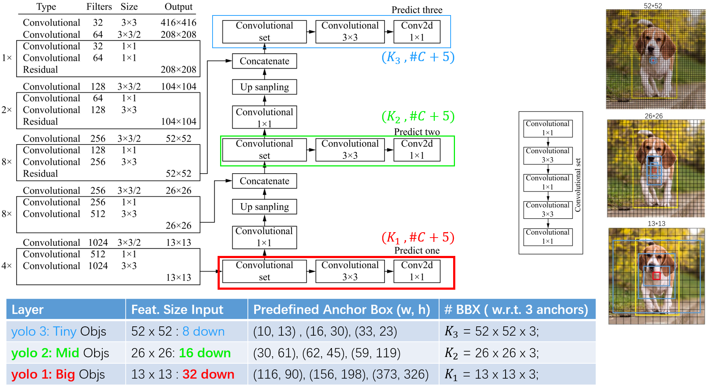

# ConvDetect 

## MileStones

## 01. YOLOv3 
> You Only Look Once

### Background
One stage detection algorithm, which does not need the **region proposal** stage, directly generates the category probability and position coordinate value of the object. After a single detection, the final detection result can be obtained directly. Therefore, it has faster detection speed. Typical algorithms such as YOLO, SSD, retina net are introduced. The appearance of YOLOv3 means the maturity of this method.

### Deployment
In order to adapt to different scenarios, the author developed three different scale Yolo, with the size of 608, 416, and 320. For the size of VOC data set and coco data set, 416 is more appropriate as the input size, so the scale discussed later is based on yolov3-416. 
The backbone of the YOLO v3 is a fully convolutional network , called **darknet-53**. 

After pre-trained on Imagenet, the final full connection classifier are removed, and the corresponding feature image size is about 1 / 32 of the original image size. 

### Take Home
### Limitations

## Credits

Overall Theories: 
- [deep learning object detection](https://github.com/hoya012/deep_learning_object_detection#deep-learning-object-detection)

YOLO v3:
- [PyTorch-YOLOv3](https://github.com/eriklindernoren/PyTorch-YOLOv3)

R-CNN Series:
- [Detectron2 of FAIR](https://github.com/facebookresearch/detectron2)

CornerNet:
- [CornerNet](https://github.com/princeton-vl/CornerNet)
- [CornerNet-Lite](https://github.com/princeton-vl/CornerNet-Lite)
